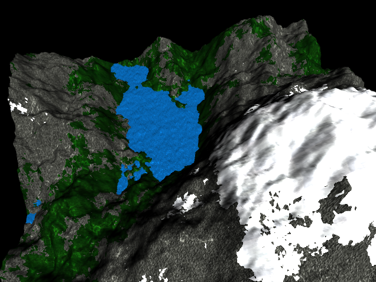

# Projet de Synthèse d'images : Création d'un terrain en c++ OpenGL
***
TOURNON Pierre - BERNABE Aurélien - M1 INFO - 2021/2022

## Screenshot
***


## Installation
***
```
$ git clone https://github.com/Momiouo/SIM_ProjetM1.git
$ cd /SIM_PROJETM1
$ qmake && make
$ ./terrain
```

## Utilisation
***
### Camera 
#### Touche clavier
flèche du haut = Zoom avant***
flèche du bas = Zoom arrière***
flèche de droite = déplacement à droite***
flèche de gauche = déplacement à gauche

#### Souris
Drag vers le bas = rotation vers le haut***
Drag vers la haut = rotation vers le bas***
Drag vers la droite = rotation vers la gauche***
Drag vers la gauche = rotation vers la droite

### Animation
Todo: Appuyer sur A pour démarrer/stopper l'animation de l'eau.

## Description de l'état de notre projet
***
### Effectué
-Application de textures***
-Utilisation du bruit de perlin***
-Creation d'une caméra

### Reste à faire
-Post Processing (Fog)***
-Une meilleure camera car limité lorsque l'on souhaite se retourner (ne fonctionne pas)***
-shadow maping

## Ressources utilisées 
***
Une liste des ressources utilisées durant le projet:
* [PerlinNoise](http://maverick.inria.fr/~Romain.Vergne/blog/teaching/IS-M1-INFO/): Cours SIM
* [Camera](https://learnopengl.com/Getting-started/Camera)
